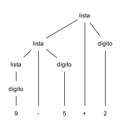
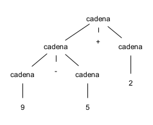
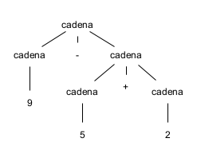

# Analizador SLR Parser

 

📌 REFERENCIA: [[2da.Ed] Compiladores, Principios, Técnicas y Herramientas - (Aho, Sethi, Ullman)](https://books.google.com.ec/books/about/Compiladores.html?id=yG6qJBAnE9UC&redir_esc=y)

 

## Teoría: Autómatas y Compiladores

En este proyecto se realiza la implementación de un analizador léxico y sintáctico que son la base de todo compilador con la finalidad de entender su funcionamiento. El analizador léxico conforma Tokens, es decir conjuntos de strings que pueden representar una sentencia, para posteriormente enviarlos al analizador sintáctico. El analizador sintáctico por su parte recibe uno a uno los Tokens enviados por el analizador léxico para procesarlos, darle sentido gramatical y verificar la correcta estructura del lenguaje de programación definido.

Todo lo que se desarrolló durante el proyecto se presenta en el siguiente [Informe](./doc/Informe.pdf).

### Análisis Sintáctico

Por lo general, en el análisis sintáctico se utilizan estructuras de datos de árboles para recorrer el lenguaje de programación, puede hacérselo de izquierda a derecha (LR) y se lo puede hacer ascendente (desde las hojas hacia la raíz) o descendentemente (desde la raíz hacia las hojas).

### Errores

Un compilador aparte de estructurar el lenguaje de programación también es el encargado de manejar los posibles errores al momento de analizar el código fuente, debido a que los programas que se sirven como entrada al compilador son propensos a tener errores: 

- léxicos: un error ortográfico en palabras reservadas e identificadores, o la omisión de comillas en cadenas de texto, 
- sintácticos: punto y comas omitidos al final de sentencias o el desbalance (desequilibrio) de paréntesis, 
- semánticos: inconsistencias en lo expresado y lo esperado como devolver en Java un `return` en una función `void`, y 
- lógicos: fallo del programador al usar el lenguaje de programación como emplear `=` en una comparación en vez de `==`.

A diferencia de un lenguaje hablado, un lenguaje de programación (de computador) requiere de precisión sintáctica. Por ende, una de las mayores dificultades para un compilador es la detección de errores semánticos y lógicos, por lo general.

### Gramática libre de contexto

Una gramática se utiliza para especificar la sintaxis de un lenguaje, es decir, describe en forma natural la estructura jerárquica de la mayoría de las instrucciones de un lenguaje de programación.

Tomando como ejemplo una instrucción del tipo `if ( expr ) instr else instr` se interpreta como: palabra clave `if`, un paréntesis abierto, una expresión, un paréntesis cerrado, una instrucción, la palabra clave `else` y otra instrucción.
La estructuración del tipo `inst` "puede tener la forma de" `if ( expr ) instr else instr`, puede expresarse como: `instr -> if ( expr ) instr else instr`, las reglas de este tipo se denominan producciones.

Entonces, dada la siguiente producción: `instr -> if ( expr ) instr else instr`, una gramática libre de contexto (o simplemente gramática) está compuesta de: 

- terminales: Token es sinónimo de terminal, pues son los símbolos básicos de los cuales se forman las cadenas o "tokens". Asumimos que son los primeros componentes que produce el analizador léxico, por ejemplo `if`, `else` y los paréntesis `(` y `)`.
- no terminales: son variabes sintácticas que denotan conjuntos de cadenas y/o terminales, por ejemplo `instr` y `expr`. Los no terminales imponen una estructura jerárquica sobre el lenguaje, que representa la clave para el análisis sintáctico y la traducción.
- producciones: tienen tres partes, un no terminal al lado izquierdo que se conoce como encabezado, una flecha divisoria, y al lado derecho una secuencia de terminales y no terminales que se conoce como cuerpo.
- símbolo inicial: por lo general un no terminal señala el símbolo inicial.

#### Derivaciones

En las derivaciones pueden utilizarse las producciones con un mismo encabezado para reemplazarlos en donde existan no terminales.

En el ejemplo a continuación:

- `llamada   -> id (paramsopc)`
- `paramsopc -> params | <>` (`|` significa "o", `<>` representa vacío, es decir `paramsopc` puede ser `params` o `vacío`)
- `params    -> params, param | param`

Se está representando una función de un lenguaje de programación, como se obseva `paramsopc` (parámetros opcionales), que en la primera producción se encuentra dentro de los paréntesis, puede reemplazarse utilizando el cuerpo de la segunda producción debido a que tiene el mismo encabezado. Lo mismo ocurre en la segunda producción con `params` que es el encabezado de la tercera producción. En la tercera producción `params` puede ser expresada mediante un conjunto de `params` más un `param`, o puede ser un `param` individual. De esta manera, la sintaxis permite definir funciones que tengan cero o más parámetros.
Es así que el problema para el Análisis Sintático es el de tomar una cadena de terminales y averiguar cómo derivarla a partir del símbolo inicial de la gramática. Este problema se enfrenta mediante teoría de árboles y grafos.

#### Árboles de análisis sintáctico

En una gramática libre de contexto un árbol de análisis sintáctico tiene las siguientes propiedades:

- La `raíz` se etiqueta con el `símbolo inicial`
- Cada `hoja` se etiqueta con un `terminal` o `<>` (vacío)
- Cada nodo `interior` se etiqueta con un `no terminal`
- Si un nodo interior `no terminal` tiene hijos con etiquetas en secuencia de izquierda a derecha (p. ej.: 1, 2, 3 o a, b ,c), entonces debe haber una producción `no terminal -> hijo1 | hijo2 | hijo3 ... hijo N`.

Teniendo en cuenta las siguientes producciones:

1. `lista  -> lista + dígito`
2. `lista  -> lista - dígito`
3. `lista  -> dígito`
4. `dígito -> 0 | 1 | 2 | 3 | 4 | 5 | 6 | 7 | 8 | 9`

Se puede deducir que para `9 - 5 + 2` se puede utilizar la primera producción y dado que se puede derivar la segunda se obtiene `lista -> lista - dígito + dígito`. Se utilizó el cuerpo de la segunda producción en la primera producción y luego se debe derivar hasta la cuarta producción. El árbol sintáctico se representaría de la siguiente manera:

 

#### Ambigüedades

Una gramática es ambigua cuando más de un árbol de análisis sintáctico puede generar una misma cadena de terminales. En los compiladores se deben diseñar gramáticas sin ambigüedades o emplear reglas adicionales que resuelvan las ambigüedades.

Partiendo del caso anterior, si no se realiza una abstracción adecuada de la gramática que se requiere representar se podría definir algo como `cadena -> cadena + cadena | cadena - cadena | 0 | 1 | 2 | 3 | 4 | 5 | 6 | 7 | 8 | 9` en donde se emplea `cadena` como una generalización de `lista` y `dígito`. Al mezclar ambos conceptos la definición tiene un sentido superficial y es propensa a crear ambigüedades debido a que un `dígito` es un tipo especial de `lista`.

 

#### Asociatividad y Precedencia de operadores

**Ejemplo 1**

En la matemática se empieza a resolver una operación aritmética por la izquierda o derecha. La suma y resta se resuelven por la izquierda mientras que la multiplicación y división por la derecha. Además la multiplicación y división tienen mayor precedencia, es decir se resuelven antes que la suma y la resta.

Sin embargo, en la mayoría de los lenguajes de programación las cuatro operaciones aritméticas (suma, resta, multiplicación y división) son asociativas por la izquierda. Esto debido a que en los compiladores la asociatividad de los árboles sintácticos emplea una estrategia distinta. Algunos operadores asociativos por la derecha comunes pueden ser potenciación y asignación.

En matemática las precedencias son de la siguiente manera:

- Asociativo por la derecha (mayor precedencia)  `* /`
- Asociativo por la izquierda (menor precedencia) `+ -`

Analicemos la siguiente gramática empleada para expresiones aritméticas:

- `expr   -> expr + term | expr - term | term`
- `term   -> term * factor | term / factor | factor`
- `factor -> dígito | (expr)`

En la gramática la precedencia se expresa de abajo hacia arriba por lo que `factor` tiene la mayor precedencia, le sigue `term` y finalmente `expr`. Además, en cada producción los operadores que están en la misma línea tienen igual asociatividad y precedencia.

Creamos dos no terminales `expr` (expresión) y `term` (término) para los dos niveles de precedencia, y un no terminal adicional `factor` para generar unidades básicas en las expresiones. Las unidades básicas son dígitos y expresiones entre paréntesis. 

En la primera producción se definen las operaciones de suma y resta, en la segunda producción se definen multiplicación y división, finalmente en la tercera producción se define el elemento fundamental para operar que son los dígitos y, cabe denotar que, también se puede emplear una expresión entre paréntesis creando así una estructura recursiva que permite un anidamiento con profundidad arbitraria.

 

**Ejemplo 2**

A continuación se presenta una gramática para un subconjunto de instrucciones de Java (sería un lenguaje diferente que guarda ciertas similitudes con Java):

`instr` -> **id** = *expresión* ;
        | **if** ( *expresión* ) *instr*
        | **if** = *expresión* ; *instr* **else** *instr*
        | **while** ( *expresión* ) *instr*
        | **do** *instr* **while** ( *expresión* ) ;
        | { *instrs* }

`instrs` -> *instrs* *instr* | `<>`

En este ejemplo las producciones de `expresión` se han omitido para facilidad. Si se analiza con detenimiento el ejemplo, la mayoría de instrucciones empiezan con una `palabra clave` o un `carácter especial`, con excepciones como las asignaciones o llamadas a procedimientos. En Java este tipo de gramática ambigua es legal.

En `instr` la primera producción es el terminal `id` que representa a cualquier identificador. En Java las instrucciones de asignación pueden anidarse en una expresión, por lo que asignaciones del tipo `a = b = c` son válidas mientras que para esta gramática no lo son.

El no terminal `instrs` genera una lista de instrucciones (posiblemente vacía) más una instrucción, o directamente una lista vacía. Adicionalmente, los signos de punto y coma son colocados sutilmente al final de los cuerpos que NO terminan en `instr`, esto para evitar agregar innecesariamente punto y come en instrucciones como `if` y `while` que terminan con subinstrucciones anidadas.

### Traducción orientada a la Sintaxis (expresiones infijas a notación postfijo)

- `Atributos`: son cualquier cantidad asociada con una construcción de programación, p.ej. tipos de datos de las expresiones, el número de instrucciones en el código generado, la ubicación de la primera instrucción, entre muchas otras posibilidades.

- `Esquemas de traducción` (orientada a la sintaxis): es una notación que permite unir los fragmentos de un programa a las producciones de una gramática. La traducción del programa se produce cuando en el análisis sintáctico se ejecutan todos los fragmentos.

#### Notación postfija

La notación postfija para una expresión *E* puede definirse de manera inductiva, como se muestra a continuación:

1. Si *E* es una variable o constante, entonces la notación postfija para *E* es la misma *E*.

1. Si *E* es una expresión de la forma *E~1~* **op** *E~2~*, entonces la notación postfija para *E* es *E'~1~* *E'~2~* **op**, en donde *E'~1~* y *E'~2~* son las notaciones postfijas de *E~1~* *E~2~*.

1. Si *E* es una expresión con paréntesis de la forma (*E~1~*), entonces la notación postfija para *E* es la misma que para *E~1~*.

## Pasos para la Construcción

1. 

## Definición del Lenguaje

### Palabras Reservadas

Una palabra reservada tiene un significado específico dentro del lenguaje de programación

| Palabra reservada | Descripción                                          |
| ----------------- | ---------------------------------------------------- |
| inicio            | inicio del programa                                  |
| fin               | final del programa                                   |
| print             | imprimir por consola                                 |
| if                | inicio de una condición                              |
| then              | cuerpo de una condición en caso de que sea verdadera |
| int               | tipo de dato para números enteros                    |

### Identificadores

Permiten definir nombres de variables `^[A-Za-z]{1}[A-Za-z0-9]*` por ejemplo:

- a1
- aa
- Ab
- aB
- a1m2n23j

### Números

Composición de números enteros o decimales de la forma `^[0-9]+([0-9]*|((\.){1}[0-9]+))$` por ejemplo:

- 1
- 11
- 1.1
- 1.11
- 11.1

### Operadores

- `+` Adición
- `*` Multiplicación
- `=` Asignación
- `==` Igualdad
- `!=` Diferencia

### Restricciones

Todas las sentencias deben terminar con `;`

## Autómata

 

### Separadores

Los separadores se constituyen a partir de los Estados Finales para la construcción de Tokens.

- `L` letra
- `d` dígito
- `( )` paréntesis
- `+` más
- `*` asterísco
- `;` punto y coma
- `' '` espacio
- `\n` salto de línea

|     | Separadores           | Función                               | Símbolos             |
| --- | --------------------- | ------------------------------------- | -------------------- |
| s1  | p. ej. `inicio`, `a1` | Palabras reservadas e identificadores | `+ * = ! ) ; ' ' \n` |
| s2  | p. ej. `1`, `130.5`   | Números                               | `+ * = ! ) ; ' ' \n` |
| s3  | p. ej. `a + b * 2`    | Operadores aritméticos                | `( ' ' \n L d`       |
| s4  | p. ej. `a = 12.3;`    | Operador de asignación                | `( ' ' L d`          |
| s5  | p. ej. `if (a == b)`  | Operadores relacionales               | `' ' L d`            |
| s6  | p. ej. `(`            | Paréntesis izquierdo                  | `' ' L d`            |
| s7  | p. ej. `)`            | Paréntesis derecho                    | `+ * ; ' ' L d`      |
| s8  | p. ej. `;`            | Fin de sentencia                      | `' ' \n L`           |
