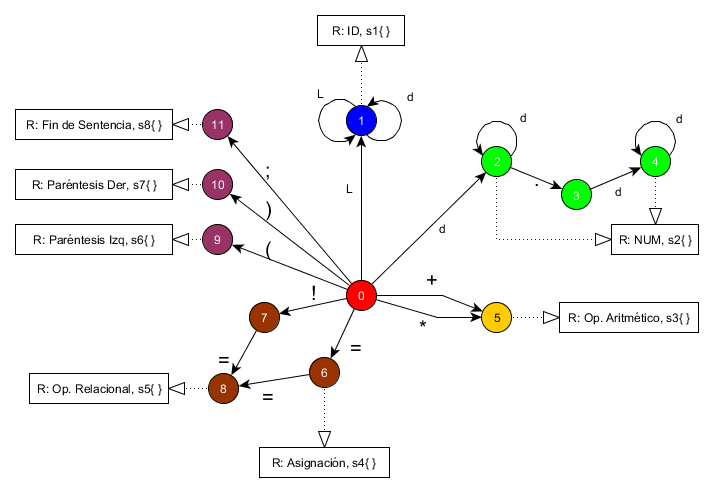

# Analizador SLR Parser

En este proyecto se realiza la implementación de un analizador léxico y sintáctico que son la base de todo compilador con la finalidad de entender su funcionamiento. El analizador léxico conforma Tokens, es decir conjuntos de strings que pueden representar una sentencia, para posteriormente enviarlos al analizador sintáctico. El analizador sintáctico por su parte recibe uno a uno los Tokens enviados por el analizador léxico para procesarlos, darle sentido gramatical y verificar la correcta estructura del lenguaje de programación definido. Finalmente todo lo que se desarrolló en el proyecto se resume en el siguiente [Informe](./doc/Informe.pdf) adjunto.

## Definición del Lenguaje

### Palabras Reservadas

Una palabra reservada tiene un significado específico dentro del lenguaje de programación

| Palabra reservada | Descripción                                          |
| ----------------- | ---------------------------------------------------- |
| inicio            | inicio del programa                                  |
| fin               | final del programa                                   |
| print             | imprimir por consola                                 |
| if                | inicio de una condición                              |
| then              | cuerpo de una condición en caso de que sea verdadera |
| int               | tipo de dato para números enteros                    |

### Identificadores

Permiten definir nombres de variables `^[A-Za-z]{1}[A-Za-z0-9]*` por ejemplo:

- a1
- aa
- Ab
- aB
- a1m2n23j

### Números

Composición de números enteros o decimales de la forma `^[0-9]+([0-9]*|((\.){1}[0-9]+))$` por ejemplo:

- 1
- 11
- 1.1
- 1.11
- 11.1

### Operadores

- `+` Adición
- `*` Multiplicación
- `=` Asignación
- `==` Igualdad
- `!=` Diferencia

### Restricciones

Todas las sentencias deben terminar con `;`

## Autómata

 

### Separadores

Los separadores se constituyen a partir de los Estados Finales para la construcción de Tokens.

- `L` letra
- `d` dígito
- `( )` paréntesis
- `+` más
- `*` asterísco
- `;` punto y coma
- `' '` espacio
- `\n` salto de línea

|     | Separadores           | Función                               | Símbolos             |
| --- | --------------------- | ------------------------------------- | -------------------- |
| s1  | p. ej. `inicio`, `a1` | Palabras reservadas e identificadores | `+ * = ! ) ; ' ' \n` |
| s2  | p. ej. `1`, `130.5`   | Números                               | `+ * = ! ) ; ' ' \n` |
| s3  | p. ej. `a + b * 2`    | Operadores aritméticos                | `( ' ' \n L d`       |
| s4  | p. ej. `a = 12.3;`    | Operador de asignación                | `( ' ' L d`          |
| s5  | p. ej. `if (a == b)`  | Operadores relacionales               | `' ' L d`            |
| s6  | p. ej. `(`            | Paréntesis izquierdo                  | `' ' L d`            |
| s7  | p. ej. `)`            | Paréntesis derecho                    | `+ * ; ' ' L d`      |
| s8  | p. ej. `;`            | Fin de sentencia                      | `' ' \n L`           |
